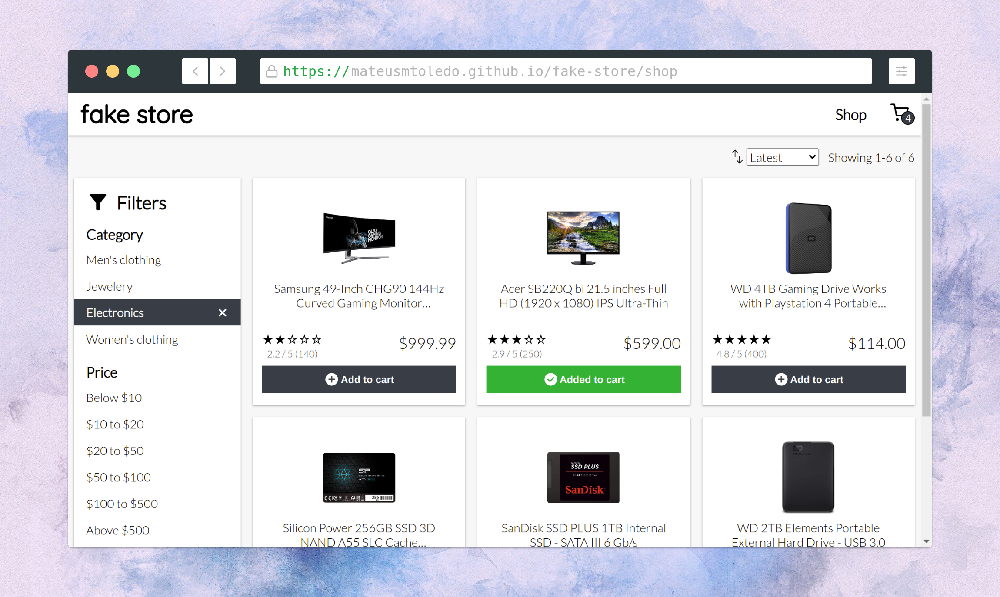

  

  A fake web store app built with React.

  

  <a href="https://mateusmtoledo.github.io/fake-store/">Live demo</a>

  

## Features

- Product filtering and sorting
- Cart page with order details
- Client side routing with react-router-dom
- Unit and integration tests with Jest and react-testing-library

## Setup

1.  Clone this repository.
2.  Open a terminal and navigate into the root directory of your local repository.
3.  Install dependencies:

        npm install

4.  Start the app:

        npm start

The application will be available at http://localhost:3000/.

## Tests

This app features unit and integration tests with **jest** and **testing-library**.

The test runner can be launched in the root directory by running:

    npm test
